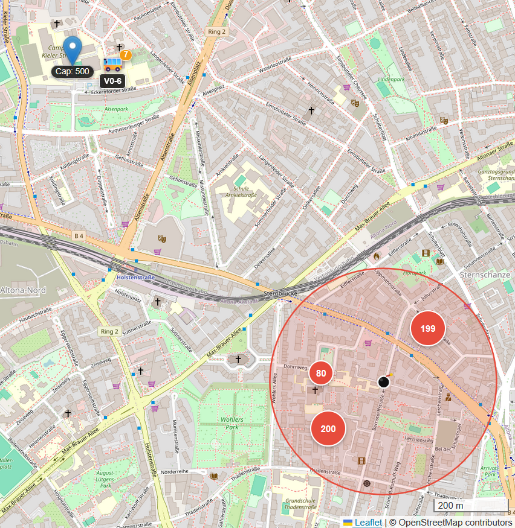
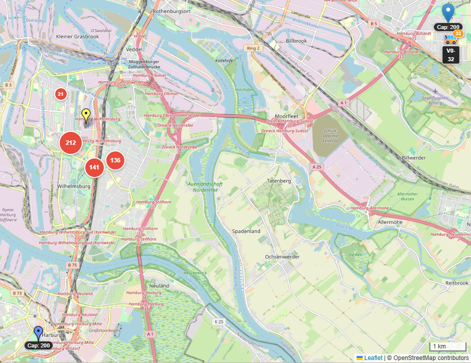
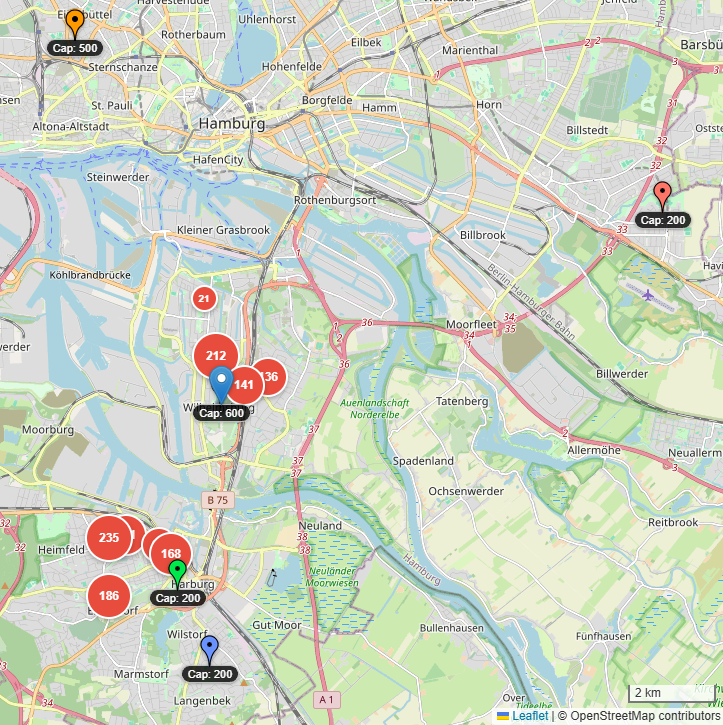

# Evacuation Route Optimization Benchmark Repository

## Overview

This repository contains the benchmark datasets and evaluation tooling for the **Nursing Home Evacuation Vehicle Routing Problem (NH-Evac-VRP)**. It includes precomputed problem instances, example solutions, and a reference evaluator that checks constraints and computes the objective.

The NH-Evac-VRP addresses the operational challenge of evacuating mobility-impaired nursing home residents during urban emergencies. Key distinguishing features from standard VRP benchmarks include:

- **Split pickups**: Facility populations often exceed vehicle capacity, requiring multiple vehicles to cooperate
- **Load-dependent service times**: Assisted boarding scales with the number of evacuees
- **Finite shelter capacities**: Load balancing across destinations is required
- **Open-ended shuttle topology**: Vehicles chain trips without returning to a central depot
- **Heterogeneous fleets**: Mixed specialized medical transport and requisitioned buses

New optimization runs default to a strict **300-second (5-minute) end-to-end solver budget**. The committed paper results used the separately documented `legacy_results` boundary-based protocol.

---

## Table of Contents

- [Overview](#overview)
- [Problem Definition](#problem-definition)
  - [Service Time Model](#service-time-model)
  - [Objective Function](#objective-function)
  - [Constraints](#constraints)
- [Hamburg Benchmark Suite](#hamburg-benchmark-suite)
  - [Fleet Model](#fleet-model)
  - [Scenario Summary](#scenario-summary)
  - [Scenario I: UXO Discovery](#scenario-i-uxo-discovery-altona-altstadt)
  - [Scenario II: Flood](#scenario-ii-flood-wilhelmsburg)
  - [Scenario III: Synthetic MassTransit](#scenario-iii-synthetic-masstransit)
- [Algorithms](#algorithms)
  - [Dispatcher Baseline](#dispatcher-baseline)
  - [Genetic Algorithm (GA)](#genetic-algorithm-ga)
  - [Memetic Algorithm (MA)](#memetic-algorithm-ma)
  - [Adaptive Large Neighborhood Search (ALNS)](#adaptive-large-neighborhood-search-alns)
- [Runtime Protocol](#runtime-protocol)
- [Data Layout](#data-layout)
- [App Setup](#app-setup-frontend--backend)
- [Evaluation](#evaluation)
  - [Units and Indexing](#units-and-indexing)
  - [Solution Format (JSON)](#solution-format-json)
  - [Custom Evaluation Inputs](#custom-evaluation-inputs)
- [Citation, Data Provenance & License](#citation)

---

## Problem Definition

### Service Time Model

Service time at each location depends on the number of evacuees handled:

```
τ(q) = τ₀ + α·q
```

where:
- `τ₀ = 3 min` accounts for vehicle positioning and paperwork
- `α = 20 s/person ≈ 0.33 min/person` reflects per-evacuee boarding assistance

This applies symmetrically to both pickup (boarding) and delivery (alighting) operations.

### Objective Function

The optimization minimizes:

```
J = W̄ + T_max + β · P_over
```

where:
- `W̄` = demand-weighted average waiting time (minutes)
- `T_max` = makespan, i.e., time when the last evacuee arrives at a shelter (minutes)
- `P_over` = shelter overfill penalty (sum of excess load across all shelters)
- `β = 1 min/person` converts overflow into equivalent delay

### Constraints

Solutions must satisfy:
- **Demand satisfaction** (hard): All evacuees must be transported
- **Vehicle capacity** (hard): Trip load ≤ vehicle capacity
- **Route continuity** (hard): End depot of trip *t* = start depot of trip *t+1*
- **Shelter capacity** (soft): Penalized via `P_over` when violated

---

## Hamburg Benchmark Suite

The suite includes three scenarios: two expert-designed cases (UXO discovery and flood) and one synthetic stress-test for scalability under resource scarcity. Scenario definitions were validated by municipal civil protection personnel using real facility data and asymmetric road-network travel times.

### Fleet Model

| Vehicle Type | Description | Operational Capacity |
|--------------|-------------|---------------------|
| N-KTW | Patient transport vehicle (Notfall-Krankentransportwagen) | 2 seats |
| MZF | Multi-purpose vehicle (Mehrzweckfahrzeug) | 7 seats |
| Standard Bus | Requisitioned public transit | 40 seats |
| Articulated Bus | Requisitioned public transit | 80 seats |

Operational capacities are set below manufacturer maximums to preserve space for medical staff and mobility aids.

### Scenario Summary

| Scenario | Depots | Facilities | People | Fleet Configurations |
|----------|--------|------------|--------|---------------------|
| UXO Discovery (Altona-Altstadt) | 1 | 3 | 479 | Specialized (22), Augmented (62) |
| Flood (Wilhelmsburg) | 3 | 4 | 510 | Specialized (107), Augmented (187) |
| Synthetic MassTransit | 5 | 9 | 1,348 | MassTransit (240) |

### Scenario I: UXO Discovery (Altona-Altstadt)

WWII 500 lb aerial bomb discovery at 53.5592°N, 9.9592°E with a 300m exclusion zone. Three nursing homes require evacuation to a single emergency shelter (capacity 500). Dense urban setting with short travel distances; no shelter load balancing required.

**Fleet configurations:**
- *Specialized*: 4 N-KTW (cap 2) + 2 MZF (cap 7) = 22 seats/round
- *Augmented*: Specialized + 1 Bus (cap 40) = 62 seats/round

### Scenario II: Flood (Wilhelmsburg)

Storm surge affecting a low-lying district on the Elbe river island. Four nursing homes require evacuation distributed across three school shelters (capacity 200 each). Load balancing across shelters is required; shelters are sited on higher ground outside the flood zone.

**Fleet configurations:**
- *Specialized*: 22 N-KTW (cap 2) + 9 MZF (cap 7) = 107 seats/round
- *Augmented*: Specialized + 2 Buses (cap 40) = 187 seats/round

### Scenario III: Synthetic MassTransit

Synthetic stress-test with 9 facilities across Wilhelmsburg and Harburg districts. Tests algorithm performance under resource scarcity with approximately 6 complete shuttle rotations required.

**Fleet configuration:**
- *MassTransit*: 3 articulated buses (cap 80) = 240 seats/round

### Scenario Screenshots

<table>
  <tr>
    <td></td>
    <td></td>
    <td></td>
  </tr>
  <tr>
    <td>UXO Discovery (Altona-Altstadt)</td>
    <td>Flood (Wilhelmsburg)</td>
    <td>Synthetic MassTransit</td>
  </tr>
</table>

---

## Algorithms

### Code Locations

Algorithm implementations live in the backend:

- Dispatcher baseline: `app/backend/app/evacuation/baselines/pendelverkehr.py`
- Genetic algorithm (GA): `app/backend/app/evacuation/ea.py`
- Memetic algorithm (MA) local search: `app/backend/app/evacuation/local_search/memetic.py`
- ALNS: `app/backend/app/evacuation/alns_algorithm.py`
- Shared helpers: `app/backend/app/evacuation/core.py`, `app/backend/app/evacuation/utils.py`, `app/backend/app/evacuation/metrics.py`, `app/backend/app/evacuation/scenarios.py`, `app/backend/app/evacuation/algorithm_interface.py`
### Dispatcher Baseline

The Dispatcher (referred to as "Pendelverkehr" in the codebase) serves as the constructive heuristic baseline. It models an experienced human coordinator with perfect information, operating in event-driven fashion where the earliest-available vehicle is assigned to the nearest facility with remaining demand.

#### Core Mechanisms

**Node Selection:** Selects the next pickup node using a "nearest" strategy that greedily picks the closest unserved node to minimize immediate travel time.

**Secondary Stop Addition:** When a bus is under-utilized (below 60% capacity after the primary pickup), searches for a second stop that minimizes detour time to improve vehicle utilization.

**Nearest Depot Return:** After completing pickups, buses return to the nearest depot with sufficient remaining capacity, falling back to the nearest depot if all are at capacity.

**Event-Driven Dispatch:** Buses are dispatched based on next available time rather than round-robin, ensuring the earliest-available bus always takes the next trip.

The Dispatcher serves as the seed solution for metaheuristics.

---

### Genetic Algorithm (GA)

The GA maintains a population of 200 individuals evolved through selection, crossover, and mutation. The initial population combines a Dispatcher seed, mutated variants, and random solutions.

#### Crossover Operators

**Sub-Schedule Crossover (SSX):** Exchanges trip sequences between buses of the same capacity using one-point crossover. Preserves capacity constraints while enabling exploration of different route combinations.

**Best Trip Injection Crossover (BTIX):** Identifies the highest-efficiency trip (people per minute) from one parent and inserts it at the optimal position in the other parent. Propagates well-performing route segments across the population.

**Time-Slice Crossover (TSX):** Selects a random time window, extracts all trips within that window from both parents, swaps them, and greedily reinserts. Enables exploration of alternative scheduling patterns for specific evacuation phases.

#### Mutation Operators

**Intra-Swap:** Randomly swaps the order of two stops within the same trip for 2-opt-style route improvement.

**Relocate Stop:** Moves a single stop between trips while respecting capacity constraints to balance workload across the fleet.

**Add/Remove Trip:** Creates new trips to serve remaining demand or removes existing trips to adjust solution structure.

**Change Depot:** Randomly changes a trip's end depot to explore alternative shelter assignments.

**Swap Trip:** Exchanges entire trips between two buses when both have sufficient capacity for the swapped loads.

**Spatial Ruin & Recreate:** Removes a spatially clustered group of stops and greedily reinserts them at minimum-detour positions to break local optima.

#### Repair Operator

**Repair:** Transforms invalid individuals into feasible solutions through: (1) sanitizing stops, (2) correcting over-servicing by trimming excess pickups, (3) splitting over-capacity trips across buses, and (4) satisfying remaining demand with new trips. Also enforces depot connectivity so each bus's first trip starts from its origin and subsequent trips chain correctly.

---

### Memetic Algorithm (MA)

The MA extends the GA with local search applied to selected individuals. It employs a portfolio of 15 operators scheduled adaptively based on improvement-per-second, with operator weights shifting across the optimization timeline: early phases emphasize structural changes, late phases emphasize makespan reduction and consolidation.

#### Local Search Operators

**intra_trip:** Optimizes stop sequence within a trip using permutation-based TSP improvement, accounting for heterogeneous fleet origins.

**relocate:** Moves individual stops between trips, optionally splitting pickups when capacity prevents full relocation. Uses a randomized candidate list for diversification.

**swap_stops:** Exchanges two stops between different trips while respecting per-bus capacity constraints.

**swap_trips:** Swaps entire trips between buses and repairs depot connectivity afterward.

**move_trip:** Relocates an entire trip to another bus at any insertion position for large-scale schedule restructuring.

**change_depot:** Reassigns a trip's end depot to minimize return travel time or balance depot loads.

**quantity_rebalance:** Moves a node’s pickup quantity from later-arriving trips to earlier ones with spare capacity, pulling demand forward and potentially removing redundant later stops.

**balance_makespan:** Identifies the bottleneck bus (latest finish time) and offloads stops to buses with slack capacity.

**takeover_gap:** Detects timeline gaps where one bus finishes just before another's trip begins and reassigns the upcoming trip.

**fill_idle_time:** Assigns new trips to buses finishing significantly before the makespan, pulling late pickups forward.

**consolidate_trips:** Merges two trips that fit within capacity and re-optimizes the combined stop sequence to reduce trip count.

**spatial_relocate:** Identifies trips with long deadhead drives and reassigns them to geographically closer buses.

**split_mixed:** Extracts the smallest stop from multi-stop trips on large buses and assigns it to smaller vehicles.

**crumb_extract:** Removes small pickups (<15% capacity) from the bottleneck bus and creates new trips on the slackest bus.

**self_consolidate:** Scans a bus's schedule for repeated visits to the same node and merges passengers into earlier trips.

---

### Adaptive Large Neighborhood Search (ALNS)

ALNS iteratively destroys and repairs solutions with adaptive operator selection based on historical performance. It uses simulated annealing acceptance (cooling rate 0.999) with temperature reheats after prolonged stagnation.

#### Destroy Operators

**Random Stop:** Removes a random selection of stops for baseline diversification without structural bias.

**Worst Detour:** Removes stops contributing the largest travel time detour to target inefficient insertions.

**Shaw Related:** Selects a seed stop and removes spatially related stops, biased toward stops on the same bus or trip.

**Route:** Removes entire trips rather than individual stops for large-scale restructuring.

**Node Cluster:** Identifies a spatial cluster and removes all stop entries serving those nodes, useful for reconsidering demand allocation in split-pickup problems.

**Bottleneck:** Targets the bus with the longest finish time and removes stops from schedule end to directly attack makespan.

#### Repair Operators

**Greedy:** Inserts each removed request at the lowest-cost position considering travel detour, service time, and makespan penalty.

**Regret-2 / Regret-3:** Prioritizes inserting requests with the largest difference between best and second/third-best insertion options to prevent costly forced insertions later.

---

## Runtime Protocol

The experiment runner exposes two explicit runtime protocols:

- `strict` (default for new runs) starts timing at solver entry, includes initialization, reserves a small postprocessing allowance, checks the deadline within generations/iterations and local search, and returns the last fully evaluated incumbent.
- `legacy_results` reproduces the protocol used by the committed results in `benchmark_data/solutions/main_results`: the 300-second clock covers the optimization loop, the limit is checked at generation/iteration boundaries, and an active work unit is allowed to finish. Initialization and result construction are measured separately.

Run a new strict experiment suite with:

```bash
python benchmark_scripts/run_paper_experiments.py --budget-mode strict
```

Use the compatibility mode only when reproducing the published execution protocol:

```bash
python benchmark_scripts/run_paper_experiments.py --budget-mode legacy_results
```

Each solver result records `budget_mode`, budget scope, preprocessing, optimization and total runtime, plus strict-budget adherence and overshoot. The runner refuses to mix protocols when resuming a directory and does not save a strict run that reports an overrun. Existing published result files are retained unchanged.

The deterministic budget and solver smoke tests do not run the benchmark suite:

```bash
python -m unittest discover -s tests -v
```

---

## Data Layout

```
benchmark_data/
├── precomputed_matrices/matrices/   # Problem definitions and distance matrices
├── solutions/                       # Raw solver outputs used in analysis
└── example_solutions/               # Small example solutions for evaluation

benchmark_scripts/                   # Analysis and evaluation scripts
```

Fleet definitions live in `benchmark_data/vehicles/` (one JSON file per scenario/fleet).

## App Setup (Frontend + Backend)

The interactive demo lives in `app/frontend` (Next.js) and `app/backend` (FastAPI).

### Backend API

Python 3.11 is required.

```bash
cd app/backend
python -m venv venv
# Windows:
venv\Scripts\activate
# macOS/Linux:
source venv/bin/activate
pip install -r requirements.txt
uvicorn app.main:app --reload --port 8000
```

If you need live routing or matrix generation, set `ORS_KEY` in `app/backend/.env`:

```text
ORS_KEY=your_api_key_here
```

### Frontend

Node 18+ is required.

Create `app/frontend/.env.local`:

```text
NEXT_PUBLIC_API_BASE_URL=http://localhost:8000
```

Then run:

```bash
cd app/frontend
npm install
npm run dev
```

Open http://localhost:3000 in your browser.

### One-command (Windows)

`start-dev.bat` starts both services and bootstraps the backend venv + dependencies if missing.

## Static Service-Time Ablation

The `benchmark_data/solutions/staticservicetime_abliation` directory contains static service-time runs. Baseline runs are labeled `Dispatcher_staticservice`. The analysis script treats both Dispatcher and Shuttle prefixes as the baseline when plotting.

---

## Evaluation

Python 3.11 is required.

Install minimal dependencies and run an example:

```bash
python -m pip install numpy
python benchmark_scripts/evaluate_solution.py \
    --scenario BombThreat \
    --fleet specialized_only \
    --solution benchmark_data/example_solutions/bombthreat_specialized_only_example.json
```

Scenario keys used in file paths and CLI:
- `BombThreat` → UXO Discovery
- `FloodWilhelmsburg` → Flood
- `Default` → Synthetic MassTransit

Example with explicit fleet file (useful outside the backend):

```bash
python benchmark_scripts/evaluate_solution.py \
    --problem benchmark_data/precomputed_matrices/matrices/BombThreat_augmented_problem.json \
    --vehicles benchmark_data/vehicles/BombThreat_augmented_vehicles.json \
    --solution benchmark_data/example_solutions/bombthreat_augmented_example.json
```

If you use a coord-start fleet and want exact first-leg times, pass the matching
`*_first_leg.json` with `--first-leg` (optional; otherwise haversine + avg_speed_kmh is used).
The first-leg files live next to the problem files in `benchmark_data/precomputed_matrices/matrices/`.

### Units and Indexing

- `durations_matrix` values are seconds.
- Service time parameters and all objective terms are in minutes (overfill penalty = 1 min/person).
- Node indexing: depots are `0..n_depots-1`; facilities are `0..n_facilities-1` in `facilities` order.
  The `durations_matrix` is indexed as [depots..., facilities...], and `stops` / `pickup_counts`
  use facility indices.

### What the Evaluator Checks

- Demand satisfaction (exact)
- Capacity per trip
- Depot chaining (end_depot of trip *i* == start_depot of trip *i+1*)
- Reachability along the provided duration matrix

---

## Solution Format (JSON)

Top-level can be either a raw list of vehicles or a dict with `best_solution`. Each vehicle is a list of trips; each trip uses `stops` + `pickup_counts`.
`stops` entries are facility indices (`0..n_facilities-1`) in the order listed in the problem file.

Example (single vehicle, single trip):

```json
{
  "best_solution": [
    [
      {
        "start_depot": 0,
        "stops": [0, 2],
        "end_depot": 0,
        "pickup_counts": {"0": 40, "2": 40}
      }
    ]
  ]
}
```

---

## Custom Evaluation Inputs

For evaluation with custom problem instances or fleets:

| Flag | Description |
|------|-------------|
| `--problem` | Path to problem.json |
| `--vehicles` | Path to vehicles.json (list of {capacity, start_*}); see `benchmark_data/vehicles/` |
| `--matrix` | Path to durations_matrix.json (if problem lacks durations_matrix) |
| `--first-leg` | Path to first_leg.json (only needed for coord-start vehicles) |

---

## Citation

If you use this benchmark in your research, please cite:

```bibtex
@inproceedings{alexander2026nhevac,
  author    = {Alexander, Nick and Tannenbaum, Milva and Noennig, J{\"o}rg Rainer},
  title     = {Operational Decision Support for Evacuating Nursing Home Residents:
               A Hamburg Benchmark and Metaheuristic Comparison Under a 5-Minute Time Budget},
  booktitle = {Proceedings of the Genetic and Evolutionary Computation Conference (GECCO '26)},
  year      = {2026},
  publisher = {ACM},
  address   = {San Jose, Costa Rica},
  doi       = {10.1145/3795095.3805113},
  note      = {To appear}
}
```

## Data Provenance

Parts of the benchmark inputs and precomputed routing artifacts derive from third-party
public-sector geodata and routing services. Those materials remain subject to their
source-specific attribution and license terms.

| Material | Repository Paths | Source | License / Attribution |
|----------|------------------|--------|-----------------------|
| Care facility source data | `app/backend/data/de_hh_up_vollstationaere_pflegeeinrichtungen_EPSG_4326.json`, `app/backend/data/de_hh_up_vollstationaere_pflegeeinrichtungen_EPSG_4326-Copy1.json`, and benchmark inputs derived from these locations and capacities | Hamburg Geoportal / Transparenzportal, dataset and WFS "Vollstationaere Pflegeeinrichtungen Hamburg" | Datenlizenz Deutschland Namensnennung 2.0; source attribution: Freie und Hansestadt Hamburg, Behoerde fuer Arbeit, Gesundheit, Soziales, Familie und Integration |
| Shelter source data | Benchmark problem instances and derived benchmark inputs containing Hamburg shelter / depot locations | Hamburg Geoportal / Transparenzportal, dataset and WFS "Notunterkuenfte Hamburg" | Datenlizenz Deutschland Namensnennung 2.0; source attribution: Freie und Hansestadt Hamburg, Bezirksamt Hamburg-Mitte |
| Travel-time matrices and first-leg routing data | `benchmark_data/precomputed_matrices/matrices/*.json` and `benchmark_data/solutions/**/matrices/*.json` | Generated with openrouteservice | openrouteservice API results are provided under CC-BY 4.0; attribution: (c) openrouteservice.org by HeiGIT \| Map data (c) OpenStreetMap contributors |

The benchmark problem instances in this repository are transformed derivatives prepared
for research and evaluation. When reusing them, retain the above source attributions and
indicate that the original data were transformed for benchmark use.

Additional source details and links are listed in [THIRD_PARTY_NOTICES.md](THIRD_PARTY_NOTICES.md).

## License

Unless otherwise noted, repository-authored code, documentation, and benchmark packaging
materials are licensed under the
Creative Commons Attribution 4.0 International license (`CC-BY-4.0`).

You can find the full license text in [LICENSE](LICENSE) or at:
https://creativecommons.org/licenses/by/4.0/

Third-party dependencies, public-sector source geodata, and routing-derived matrices
remain subject to their own respective licenses, attribution requirements, and terms.
See [THIRD_PARTY_NOTICES.md](THIRD_PARTY_NOTICES.md) for the specific Hamburg Geoportal
and openrouteservice notices that apply to those materials.
